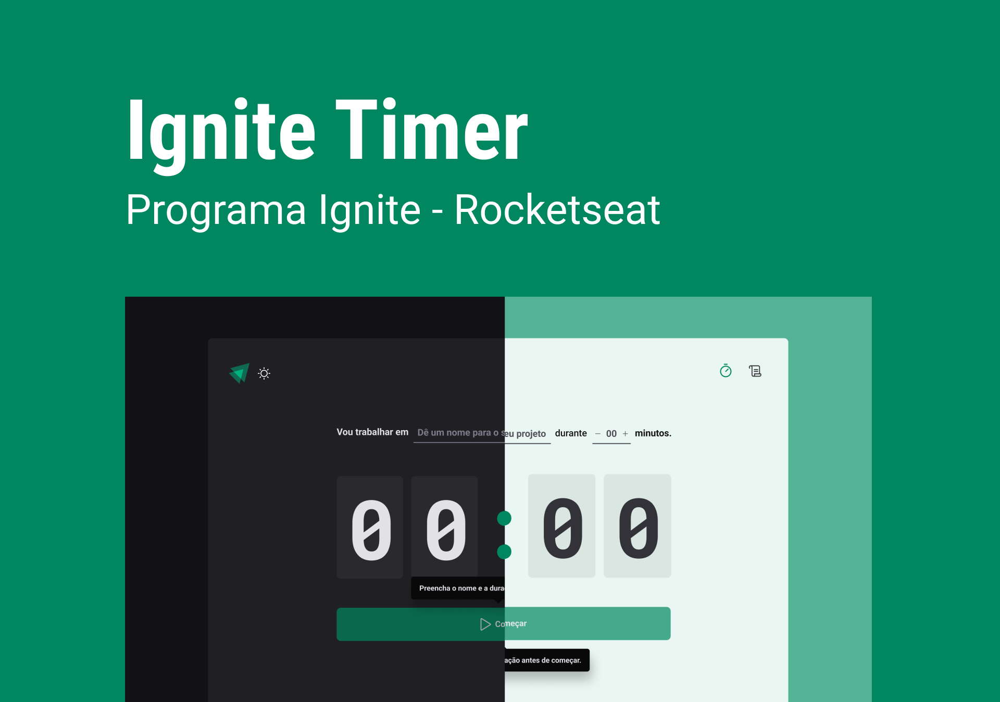

<div align="center" id="top"> 
  

  &#xa0;

  <!-- <a href="https://ignite-timer.netlify.com">Demo</a> -->
</div>

<h1 align="center">Whatch Me</h1>


<!-- Status -->

<!-- <h4 align="center"> 
	🚧  Whatch Me 🚀 Em construção...  🚧
</h4> 
<hr> -->

<p align="center">
  <a href="#dart-sobre">Sobre</a> &#xa0; | &#xa0; 
  <a href="#sparkles-funcionalidades">Funcionalidades</a> &#xa0; | &#xa0;
  <a href="#rocket-tecnologias">Tecnologias</a> &#xa0; | &#xa0;
  <a href="#white_check_mark-pré-requesitos">Pré requisitos</a> &#xa0; | &#xa0;
  <a href="#checkered_flag-começando">Começando</a> &#xa0; | &#xa0;
  <a href="#memo-licença">Licença</a> &#xa0; | &#xa0;
  <a href="https://github.com/aleilson" target="_blank">Autor</a>
</p>

<br>

## :dart: Sobre ##

Ignite timer é uma aplicação da técnica Pomodoro, é um método de gerenciamento de tempo. A técnica consiste na utilização de um cronômetro para dividir o trabalho em períodos de 25 minutos ou mais, separados por breves intervalos.

## :sparkles: Funcionalidades ##

:heavy_check_mark: useReducer para disparar actions na aplicação e no localstorage.
:heavy_check_mark: immer para simplificar o manuseio de estruturas de dados imutáveis.
:heavy_check_mark: criação de ciclos e listagem para a aplicação.

## :rocket: Tecnologias ##

As seguintes ferramentas foram usadas na construção do projeto:


- [Vite - React](https://vitejs.dev/)
- [TypeScript](https://www.typescriptlang.org/)
- [styled-components](https://styled-components.com/)


## :white_check_mark: Pré requisitos ##

Antes de começar :checkered_flag:, você precisa ter o [Git](https://git-scm.com) e o [Node](https://nodejs.org/en/) instalados em sua maquina.

## :checkered_flag: Começando ##

```bash
# Clone este repositório
$ git clone https://github.com/aleilson/ignite-timer
# Entre na pasta
$ cd ignite-timer
# Instale as dependências
$ yarn install
# Para iniciar o projeto
$ yarn dev para front-end
# O app vai inicializar em <http://localhost:3000>
```

## :memo: Licença ##

Este projeto está sob licença MIT. Veja o arquivo [LICENSE](LICENSE.md) para mais detalhes.


Feito com :heart: por <a href="https://github.com/aleilson" target="_blank">aleilson</a>

&#xa0;

<a href="#top">Voltar para o topo</a>